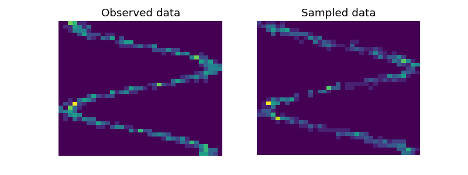

### Mixture Density Network

Last update: December 2022.

---

Lightweight implementation of a mixture density network [1] in PyTorch.

#### Setup

Suppose we want to regress response $\mathbf{y} \in \mathbb{R}^{d}$ using covariates $\mathbf{x} \in \mathbb{R}^n$.

We model the conditional distribution as a mixture of Gaussians
```math
p_\theta(\mathbf{y}|\mathbf{x}) = \sum_{k=1}^K \pi_k N(\boldsymbol\mu^{(k)}, {\boldsymbol\Sigma}^{(k)}),
```
where the mixture distribution parameters are output by a neural network dependent on $\mathbf{x}$.
```math
\begin{align*}
( \boldsymbol\pi & \in\Delta^{K-1} & \boldsymbol\mu^{(k)}&\in\mathbb{R}^{d} &\boldsymbol\Sigma^{(k)}&\in \mathrm{S}_+^d) = f_\theta(\mathbf{x})
\end{align*}
```
The training objective is to maximize log-likelihood. The objective is clearly non-convex.
```math
\begin{align*}
\log p_\theta(\mathbf{y}|\mathbf{x})
& \propto\log \sum_{k}\left(\pi_k\exp\left(-\frac{1}{2}\left(\mathbf{y}-\boldsymbol\mu^{(k)}\right)^\top {\boldsymbol\Sigma^{(k)}}^{-1}\left(\mathbf{y}-\boldsymbol\mu^{(k)}\right) -\frac{1}{2}\log\det \boldsymbol\Sigma^{(k)}\right)\right)\\
& = \mathrm{logsumexp}_k\left(\log\pi_k - \frac{1}{2}\left(\mathbf{y}-\boldsymbol\mu^{(k)}\right)^\top {\boldsymbol\Sigma^{(k)}}^{-1}\left(\mathbf{y}-\boldsymbol\mu^{(k)}\right) -\frac{1}{2}\log\det \boldsymbol\Sigma^{(k)}\right)\\
\end{align*}
```
Importantly, we need to use `torch.log_softmax(...)` to compute logits $\log \boldsymbol\pi$ for numerical stability.

#### Noise Model

There are several options we can make to constrain the noise model $\boldsymbol\Sigma^{(k)}$.

1. No assumptions, $\boldsymbol\Sigma^{(k)} \in \mathrm{S}_+^d$.
2. Fully factored, let $\boldsymbol\Sigma^{(k)} = \mathrm{diag}({\boldsymbol\sigma^{(k)}}^{2}), {\boldsymbol\sigma^{(k)}}^{2}\in\mathbb{R}_+^d$ where the noise level for each dimension is predicted separately.
3. Isotrotopic, let $\boldsymbol\Sigma^{(k)} = {\sigma^{(k)}}^{2}\mathbf{I}, {\sigma^{(k)}}^{2}\in\mathbb{R}_+$ which assumes the same noise level for each dimension over $d$.
4. Isotropic across clusters, let $\boldsymbol\Sigma^{(k)} = \sigma^2\mathbf{I}, \sigma^2\in\mathbb{R}_+$ which assumes the same noise level for each dimension over $d$ *and* cluster.
5. Fixed isotropic, same as above but do not learn $\sigma^2$.

Thse correspond to the following objectives.
```math
\begin{align*}
\log p_\theta(\mathbf{y}|\mathbf{x}) & = \mathrm{logsumexp}_k\left(\log\pi_k - \frac{1}{2}\left(\mathbf{y}-\boldsymbol\mu^{(k)}\right)^\top {\boldsymbol\Sigma^{(k)}}^{-1}\left(\mathbf{y}-\boldsymbol\mu^{(k)}\right) -\frac{1}{2}\log\det \boldsymbol\Sigma^{(k)}\right)  \tag{1}\\
& = \mathrm{logsumexp}_k \left(\log\pi_k - \frac{1}{2}\left\|\frac{\mathbf{y}-\boldsymbol\mu^{(k)}}{\boldsymbol\sigma^{(k)}}\right\|^2-\frac{1}{2}\log\|\boldsymbol\sigma^{(k)}\|^2\right) \tag{2}\\
& = \mathrm{logsumexp}_k \left(\log\pi_k - \frac{1}{2}\left\|\frac{\mathbf{y}-\boldsymbol\mu^{(k)}}{\sigma^{(k)}}\right\|^2-\frac{d}{2}\log({\sigma^{(k)}}^2)\right) \tag{3}\\
& = \mathrm{logsumexp}_k \left(\log\pi_k - \frac{1}{2}\left\|\frac{\mathbf{y}-\boldsymbol\mu^{(k)}}{\sigma}\right\|^2-\frac{d}{2}\log(\sigma^2)\right) \tag{4}\\
& = \mathrm{logsumexp}_k \left(\log\pi_k - \frac{1}{2}\|\mathbf{y}-\boldsymbol\mu^{(k)}\|^2\right) \tag{5}
\end{align*}
```
In this repository we implement options (2, 3, 4, 5).

#### Miscellaneous

Recall that the objective is clearly non-convex. For example, one local minimum is to ignore all modes except one and place a single diffuse Gaussian distribution on the marginal outcome (i.e. high ${\sigma}^{(k)}$).

For this reason it's often preferable to over-parameterize the model and specify `n_components` higher than the true hypothesized number of modes.

#### Usage

```python
import torch
from src.blocks import MixtureDensityNetwork

x = torch.randn(5, 1)
y = torch.randn(5, 1)

# 1D input, 1D output, 3 mixture components
model = MixtureDensityNetwork(1, 1, n_components=3, hidden_dim=50)
pred_parameters = model(x)

# use this to backprop
loss = model.loss(x, y)

# use this to sample a trained model
samples = model.sample(x)
```

For further details see the `examples/` folder. Below is a model fit with 3 components in `ex_1d.py`.



#### References

[1] Bishop, C. M. Mixture density networks. (1994).

[2] Ha, D. & Schmidhuber, J. Recurrent World Models Facilitate Policy Evolution. in *Advances in Neural Information Processing Systems 31* (eds. Bengio, S. et al.) 2450–2462 (Curran Associates, Inc., 2018).

#### License

This code is available under the MIT License.
