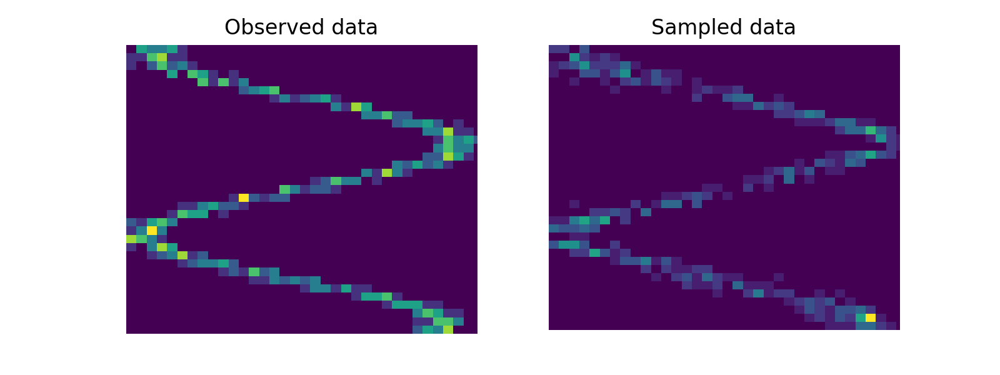

### Mixture Density Network

---

Lightweight implementation of a mixture density network [1] in PyTorch.

An MDN models the conditional distribution over a *scalar* response as a mixture of Gaussians.
<p align="center"></p>
where the mixture distribution parameters are output by a neural network, trained to maximize overall log-likelihood. The set of mixture distribution parameters is the following.
<p align="center"></p>

In order to predict the response as a *multivariate* Gaussian distribution (for example, in [2]), we assume a fully factored distribution (i.e. a diagonal covariance matrix) and predict each dimesion separately. Another possible approach would be to use an auto-regressive method like in [3], but we leave that implementation for future work.

#### Usage

```python
import torch
from mdn.model import MixtureDensityNetwork

x = torch.randn(5, 1)
y = torch.randn(5, 1)

# 1D input, 1D output, 3 mixture components
model = MixtureDensityNetwork(1, 1, 3)
pred_parameters = model(x)

# use this to backprop
loss = model.loss(x, y)

# use this to sample a trained model
samples = model.sample(x)
```

For further details see the `examples/` folder. Below is a model fit with 3 components in `ex_1d.py`.




#### References

[1] Bishop, C. M. Mixture density networks. (1994).

[2] Ha, D. & Schmidhuber, J. World Models. *arXiv:1803.10122 [cs, stat]* (2018).

[3] Van Den Oord, A., Kalchbrenner, N. & Kavukcuoglu, K. Pixel Recurrent Neural Networks. in *Proceedings of the 33rd International Conference on International Conference on Machine Learning - Volume 48* 1747–1756.

#### License

This code is available under the MIT License.
